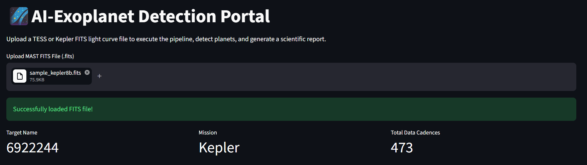
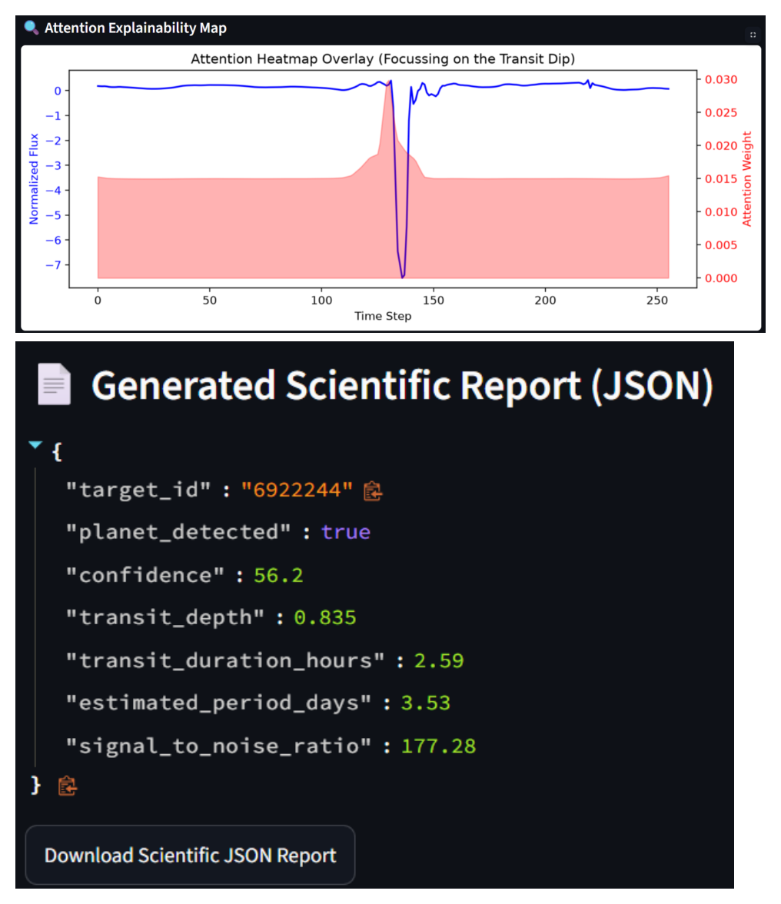

# 🌌 AI Exoplanet Detection

An end-to-end pipeline that detects exoplanets from **TESS / Kepler** light curves using signal processing and deep learning, served through an interactive **Streamlit** web app.

Upload a FITS light-curve file and the app detrends it, denoises it with wavelets, searches for transits with a Box Least Squares periodogram, classifies the signal with an attention-based neural network, explains the decision with an attention heatmap, and generates a downloadable scientific report.

> Built for the ISRO Hackathon.

---

## ✨ Features

- **Preprocessing** — normalization, flattening/detrending, and Daubechies (`db4`) wavelet denoising.
- **Transit search** — Box Least Squares (BLS) periodogram to estimate period, depth, duration, and SNR.
- **AI classification** — an attention-based deep learning model plus a Random Forest baseline.
- **Explainability** — attention heatmap overlaid on the light curve, highlighting the transit dip.
- **Scientific report** — auto-generated JSON report, downloadable from the UI.

## 🛠️ Tech Stack

`Streamlit` · `Lightkurve` · `TensorFlow / Keras` · `PyWavelets` · `scikit-learn` · `SciPy` · `NumPy` · `Pandas` · `Matplotlib`

## 🚀 Run Locally

```bash
# 1. Clone the repo
git clone https://github.com/<your-username>/AI-Exoplanet-detection.git
cd AI-Exoplanet-detection

# 2. (Recommended) create a virtual environment
python -m venv .venv
source .venv/bin/activate        # Windows: .venv\Scripts\activate

# 3. Install dependencies
pip install -r requirements.txt

# 4. Launch the app
streamlit run app.py
```

Then open the local URL Streamlit prints (usually `http://localhost:8501`) and upload a `.fits` light-curve file.

## ☁️ Live Demo

Deploy your own free instance in one click via [Streamlit Community Cloud](https://share.streamlit.io):

1. Push this repo to GitHub.
2. Go to **share.streamlit.io** → **New app** → select this repo → main file `app.py`.
3. Click **Deploy**.

https://ai-exoplanet-detection-jgfxmpb75gya9my8rew9oq.streamlit.app/
<!-- Once deployed, add your live link here: -->
<!-- **Live app:** https://your-app.streamlit.app -->

## 📸 Screenshots

**Pipeline — preprocessing, transit parameters & AI classification**



**Attention explainability map & generated scientific report**

 

## 📂 Project Structure

```
├── app.py                     # Streamlit web app (full pipeline)
├── Exoplanet_detection.ipynb  # Research & model-training notebook
├── best_advanced_model.keras  # Trained attention deep-learning model
├── rf_baseline.pkl            # Random Forest baseline model
├── requirements.txt           # Python dependencies
└── LICENSE
```

## 📄 License

Released under the [MIT License](LICENSE).

## 👤 Author

**Prakhar Neve**
